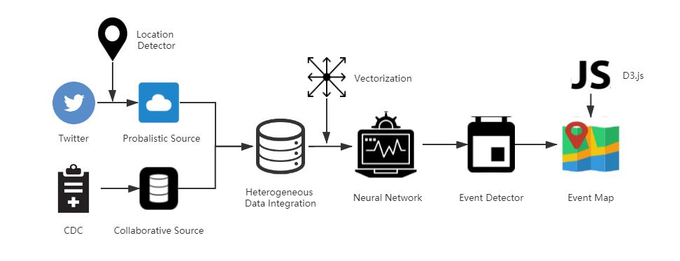

# LITMUS Project

## Overall Architecture

We used Twitter data as the probabilistic and the CDC data as the collaborative source. We created a location detector to extract the place name from an text. We used the word2vec and sent2vec to vectorize a text and we used convolutional neural network to build our classifier. At last we post the detected event on the map using JavaScript.



## Analysis Folder

This is a fold to analyze our result. The major file draw.py used regular expression extract the target data and I used matplotlib to draw the chart I need. Here I analyzed the number of tweets each and the number of confirmed cases each day. And I analyzed the number of tweets and the number of confirmed cases for each state. The collaborative.csv record the collaborative data and the twitter.json represent the probabilistic data.

<div align=center></div>

<p align="center">The number of tweets and number of cases each day</p>

<div align=center></div>

<p align="center">The number of confirmed cases for each state</p>

<div align=center></div>

<p align="center">The number of tweets for each state</p>

## Model_Training Folder

The select_negative_sample.py is used to select the negative sample for our training. And the select_positive_sample.py is used to select the positive sample for our training. By negative we means the text does not shows an event about coronavirus. The train.py is the main file for training model. First, I read the data from file and convert it into the form of input for the neural network. Than I created the embedding layer using the word vector. I used the glove data for the word vector. At last, I used 3 Conv1D layer and 3 MaxPool layer to create the model. The model is saved as my_model.h5. The predict.py is used to predict whether a text indicate our target event. The accuracy of our model is 0.7680.

## Twitter_Data Folder

This is the fold for twitter data processing. Thanks to our great TA, he provides us with the tweets about coronavirus for February and March. Then We wrote a parse which is tweet.py to extract the (data, location, text) information from the 02 and 03 folder. The StateExtraction.py is used to detect the place name in the text. Here I used Geograpy library. There are two versions of function. The location2state function is more accurate but cost more. And the location2state_v2 is less accurate but much quicker. all_tweetdata.json is the (data, location, text) we extract from 02 and 03 folder and twitter.json is the data after we select the data in the US and covert the address information into the state it belong.

## Web Folder

This is the frontend of our project. The interactive maps enables people to see the trends of Covid-19 in United States from Mar.1 to Mar.31. It can also detect the tweet events and predict if this tweet is related to a real Covid-19 event. After that, it will display the valid Tweet Message on the map. The dataset is collected from the CDC official source as well as the Tweet as the unconfirmed source.
## Data Sources 
1. [tweet](https://developer.twitter.com/en/docs/tweets/search/api-reference/get-search-tweets)
2.  [CDC](https://www.cdc.gov/)

This is the sample data after preprocessing.

``` 
CDC data:

{

	"longitude": -119.4179,
	"latitude": 36.7783,
	"messgae": Confusion prevails overr how many people in Iran have been infected, and how many have died,, from the coronavirus. \u00a0 https://t.co/FiAQxu6uB"
}

Tweet Data:

{

	"Alabama":
		{"2020-03-13":{"cofirmed": "6", "deaths":"0"}
		{"2020-03-14":{"confirmed":"12", "deaths": "0"}
}

```

## Timechart of U.S. cases
You can see the cases in United State for any date between 3.1-3.31. 

To create a map, we need the information about the shapes of states in United States. Since they are not very big, we stored and loaded them via GeoJson. The following is a sample json data.

```
{

	"type": "Feature"
	"properties":{
		"name": "Texas",
		"density": 57
	}
	"geometry": ...
}
```


The core part of the codes is to upate information on the map according to the selected data.
```
 function updateCorona(date) {
    for (var i = 0; i < statesData["features"].length; i++) {
        stateName = statesData.features[i].properties.name
        if (coronaData[stateName] == undefined) {
            console.warn(stateName);
            statesData.features[i].properties.density = 0;
        } else if (coronaData[stateName][date] == undefined) {
            statesData.features[i].properties.density = 0;
        } else {
            statesData.features[i].properties.density = coronaData[stateName][date]["confirmed"];
       	}                    
    }
}
```


## Tweet detction
In  this part, you can click on the "Click Me" button to retrieve a tweet from server, after that, it will send the message to backend to predict if this message is a valid one related to Covid-19. If so, it will added this information to the map with a marker which you can click to get detailed information. Otherwise, you will get a hint saying the message is invalid. After you have used all tweets in the server, all the Markers will be cleared.


```
function buttonFunction() {
                    clickTimes += 1
                    if (clickTimes == tweetData.length + 1) {
                        var message = document.getElementById('messageTweet')
                        var valid = document.getElementById('messageTweetValid')
                        message.innerHTML = "Click the Button to retrieve"
                        valid.innerHTML = ""
                        clickTimes =  clickTimes -tweetData.length-1
                        for( i in layerList){
                            layerList[i].remove()
                        }


                    } 
                    else {

                        var message = document.getElementById('messageTweet')
                        var valid = document.getElementById('messageTweetValid')
                        message.innerHTML = tweetData[clickTimes-1]["message"]
                        if(validFlag){
                        	valid.innerHTML = "valid"
                        	latitude = tweetData[clickTimes-1]["latitude"]
                        	longitude = tweetData[clickTimes-1]["longitude"]
                        	var layerid = L.marker([latitude, longitude], {
                            	icon: iconArray[clickTimes%3]
                        	}).addTo(map).bindPopup(tweetData[clickTimes-1]["message"]);
                        	layerList.push(layerid)
                        }
                        else{
                        	valid.innerHTML = "invalid, therefore not added to map"
                        }
                    }
                }
```


